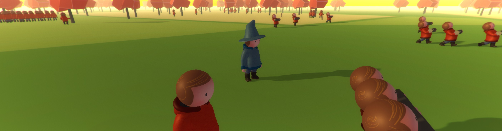

# Hello, world! (SpatialOS)

*****

Copyright Improbable 2016

* GitHub Repository: github.com/spatialos/helloworld

*****

### Introduction

This repository contains a "Hello, world!" project built with [SpatialOS](http://www.spatialos.com).
It demonstrates how to use SpatialOS to build a large and compelling simulated world.

The project serves as a starting point for the [Hello, world! SpatialOS Tutorial](https://spatialos.improbable.io/docs/reference/latest/tutorials/helloworld/hello-world).

The main documentation for SpatialOS can be found by clicking on [this link](https://spatialos.improbable.io/docs/reference/latest/index).

#### To use the repository

* Make sure you have access to SpatialOS
* Clone the repo: `git clone https://github.com/spatialos/helloworld`
* Move into the directory: `cd helloworld`
* Build the project: `spatial build`
* Run: `spatial local start`
* Connect multiple player clients: `spatial worker launch UnityClient default`
